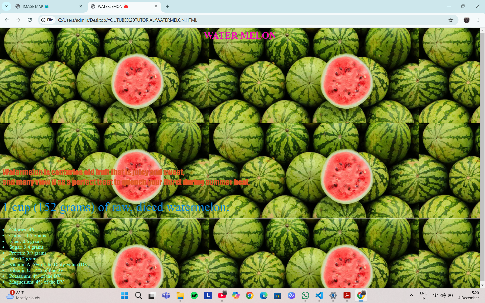
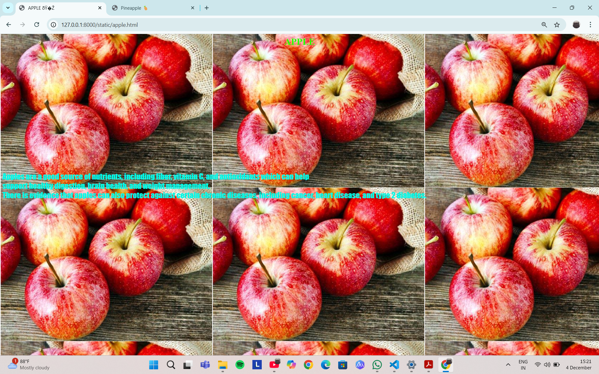
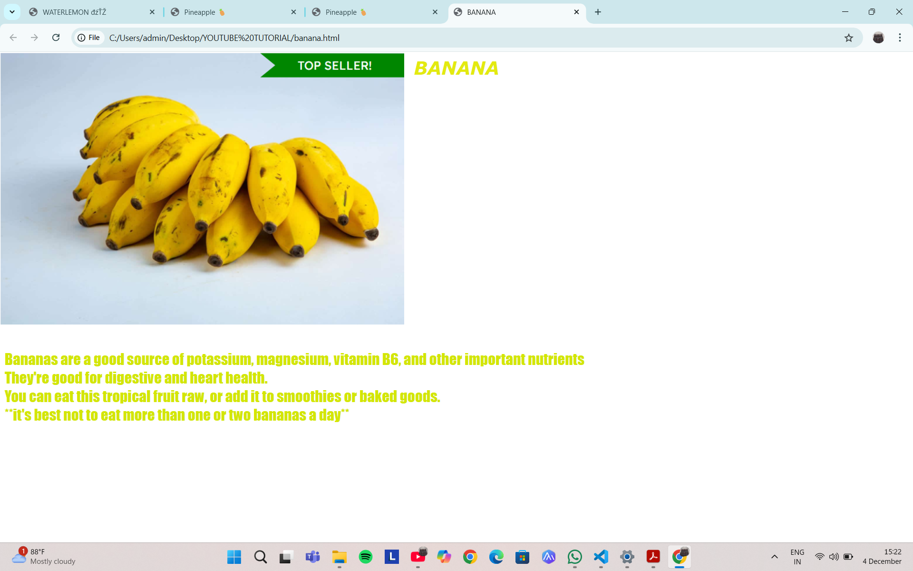
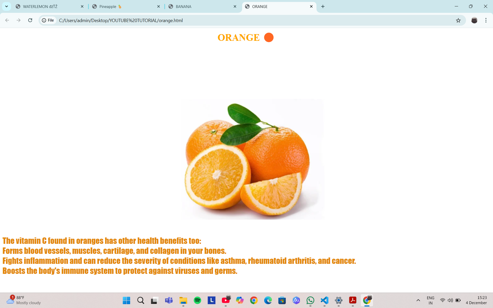

# Ex04 Places Around Me
# Date:24-10-2024
# AIM
To develop a website to display details about the places around my house.

# DESIGN STEPS
## STEP 1
Create a Django admin interface.

## STEP 2
Download your city map from Google.

## STEP 3
Using <map> tag name the map.

## STEP 4
Create clickable regions in the image using <area> tag.

## STEP 5
Write HTML programs for all the regions identified.

## STEP 6
Execute the programs and publish them.

# CODE
```
map.html

<!DOCTYPE html>
<html lang="en">
  <head>
     <meta charset="UTF-8">
     <meta name="viewport" content="width=device-width, initial-scale=1.0">
     <title>IMAGE MAP 🗺️</title>
     <link rel="stylesheet" href="style.css">
  </head>
    <body>
        <div id="container"> 

            <div id="image.container">
           
              
               <map name="image-map">
                   <area target="" alt="" title="" href="index.html" coords="497,547,365,65,447,426,742,7,598,560,512,559,526,22,463,399,416,36,717,10,388,64,331,86" shape="poly"></area>
                   <area shape="circle" coords="638,542,69" title="Circle" href="apple.html">
                   <area shape="circle" coords="242,561,134" alt="Circle" href="banana.html">
                   <area shape="circle" coords="663,424,100" title="Circle" href="WATERMELON.HTML">
                   <area shape="circle" coords="439,584,68" alt="Circle" href="orange.html">
               </map>
            </div>
        </div>
    </body>
</html>

orange.html

<HTml> <head>
    <title>ORANGE</title>
</head>

<body style="background-image: url(Screenshot\ 2024-10-20\ 142719.png);
  background-repeat: no-repeat;
  background-position: center;
  background-attachment: fixed; ">
    
    <center> <h1 style="color: orange;font-size:30px; font-style: inherit;">ORANGE 🟠</h1> </center>

    <p style="color: rgb(227, 136, 15); font-family:Impact, Haettenschweiler, 'Arial Narrow Bold', sans-serif;
    font-size: 25px; margin-top: 600PX;">The vitamin C found in oranges has other health benefits too: <br>
Forms blood vessels, muscles, cartilage, and collagen in your bones. <br>
Fights inflammation and can reduce the severity of conditions like asthma, rheumatoid arthritis, and cancer. <br>
Boosts the body's immune system to protect against viruses and germs. </p>
    
</body>
</HTml>         

index.html

<!DOCTYPE html>
<html lang="en">
<head>
    <meta charset="UTF-8">
    <meta name="viewport" content="width=device-width, initial-scale=1.0">
    <title>Pineapple 🍍</title>
    <link rel="stylesheet" href="style.css">
    
</head>
<body>
    <center>
 <h1>pineapple</h1>
</center>

<p>Pineapples are rich in flavonoids and phenolic acids,<br> two antioxidants that protect your cells from free radicals that can cause chronic diseases <br> More studies are needed, but bromelain has also been linked to reduced risk of cancer</p>

</body>
</html>

banana.html

<HTml> <head>
    <title>BANANA</title>
</head>

<body style="background-image: url(Screenshot\ 2024-10-20\ 142641.png);
       background-attachment: fixed;
       background-repeat: no-repeat;">
    
    <center><h1 style="color: rgb(227, 234, 16);font-size:30px; font-family: Verdana, Geneva, Tahoma, sans-serif; font-style: oblique;">BANANA</h1></center>

    <p style="color: rgb(211, 230, 4); font-family:Impact, Haettenschweiler, 'Arial Narrow Bold', sans-serif;
    font-size: 25px; margin-top: 400PX; margin-top: 30%;">Bananas are a good source of potassium, magnesium, vitamin B6, and other important nutrients <br> They're good for digestive and heart health. <br> You can eat this tropical fruit raw, or add it to smoothies or baked goods. 
    <br>  
    **it's best not to eat more than one or two bananas a day**
 </p>
</body>
</HTml>         

apple.html

<HTml> <head>
    <title>APPLE 🍎</title>
</head>

<body style="background-image: url(Screenshot\ 2024-10-20\ 105853.png);">
    
    <center><h1 style="color: rgb(38, 255, 0);font-size:30px;">APPLE</h1></center>

    <p style="color: rgb(0, 248, 231); font-family:Impact, Haettenschweiler, 'Arial Narrow Bold', sans-serif;
    font-size: 25px; margin-top: 400PX;">Apples are a good source of nutrients, including fiber, vitamin C, and antioxidants which can help <br>support healthy digestion, brain health, and weight management. <br> There is evidence that apples can also protect against certain chronic diseases, including cancer, heart disease, and type 2 diabetes.</p>
</body>

</HTml>         

```
# OUTPUT









# RESULT
The program for implementing image maps using HTML is executed successfully.
